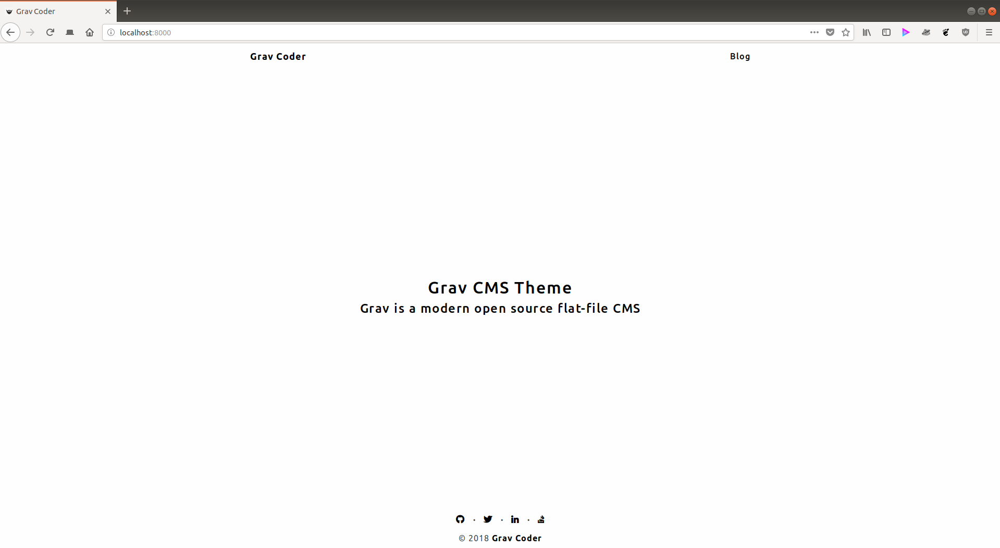

# Grav Coder

Grav Coder is a fork of [Hugo Coder](https://github.com/luizdepra/hugo-coder) and derived from customizations made to it by [Khosrow Moossavi](https://github.com/khos2ow) for his own personal website.



# Installation

Installing the Grav Coder theme can be done in one of two ways. The GPM (Grav Package Manager) installation method enables you to quickly and easily install the theme with a simple terminal command, while the manual method enables you to do so via a zip file.

### GPM Installation (Preferred)

The simplest way to install this theme is via the [Grav Package Manager (GPM)](http://learn.getgrav.org/advanced/grav-gpm) through your system's Terminal (also called the command line). From the root of your Grav install type:

    bin/gpm install grav-coder

This will install the Grav Coder theme into your `/user/themes` directory within Grav. Its files can be found under `/your/site/grav/user/themes/grav-coder`.

### Manual Installation

To install this theme, just download the zip version of this repository and unzip it under `/your/site/grav/user/themes`. Then, rename the folder to `grav-coder`. You can find these files either on [GitHub](https://github.com/ParitoshBh/grav-coder) or via [GetGrav.org](http://getgrav.org/downloads/themes).

You should now have all the theme files under

    /your/site/grav/user/themes/grav-coder

# Updating

As development for the Grav Coder theme continues, new versions may become available that add additional features and functionality, improve compatibility with newer Grav releases, and generally provide a better user experience. Updating Grav Coder is easy, and can be done through Grav's GPM system, as well as manually.

### GPM Update (Preferred)

The simplest way to update this theme is via the [Grav Package Manager (GPM)](http://learn.getgrav.org/advanced/grav-gpm). You can do this with this by navigating to the root directory of your Grav install using your system's Terminal (also called command line) and typing the following:

    bin/gpm update grav-coder

This command will check your Grav install to see if your Grav Coder theme is due for an update. If a newer release is found, you will be asked whether or not you wish to update. To continue, type `y` and hit enter. The theme will automatically update and clear Grav's cache.

### Manual Update

Manually updating Grav Coder is pretty simple. Here is what you will need to do to get this done:

* Delete the `your/site/user/themes/grav-coder` directory.
* Download the new version of the Grav Coder theme from either [GitHub](https://github.com/ParitoshBh/grav-coder) or [GetGrav.org](http://getgrav.org/downloads/themes#extras).
* Unzip the zip file in `your/site/user/themes` and rename the resulting folder to `grav-coder`.
* Clear the Grav cache. The simplest way to do this is by going to the root Grav directory in terminal and typing `bin/grav clear-cache`.

> Note: Any changes you have made to any of the files listed under this directory will also be removed and replaced by the new set. Any files located elsewhere (for example a YAML settings file placed in `user/config/themes`) will remain intact.

# Features

* Lightweight and minimal for optimal performance
* Fontawesome icon support
* Default view template
* Blog view template
* Blog item view template
* Categories view (listing)

# Setup

If you want to set Grav Coder as the default theme, you can do so by following these steps:

* Navigate to `/your/site/grav/user/config`.
* Open the **system.yaml** file.
* Change the `theme:` setting to `theme: grav-coder`.
* Save your changes.
* Clear the Grav cache. The simplest way to do this is by going to the root Grav directory in Terminal and typing `bin/grav clear-cache`.

Once this is done, you should be able to see the new theme on the frontend.

# Customizations

There are certain sections of the theme you can customize, in order to do so,
* Create `themes` directory under `/your/site/grav/user/config` (skip this step if it already exists)
* Create `grav-coder.yaml` file under `/your/site/grav/user/config/themes` (this makes sure any configurations made to theme persist when updating the theme)
* Within `grav-coder.yaml` file following configuration are available,
  ```
  # Title in navigation bar
  navbar:
    title: Grav Coder

  # Copyright text visible in footer and (start) year
  # If 'copyright_start_year' is not defined then it isn't shown
  footer:
    copyright: Grav Coder
    copyright_start_year: 2018

  # Social media icons, displayed in footer, above copyright text
  social:
    github:
      title: Github
      url: <url>
      icon: fa-github
    twitter:
      title: Twitter
      url: <url>
      icon: fa-twitter
    linkedin:
      title: LinkedIn
      url: <url>
      icon: fa-linkedin-in
    stackoverflow:
      title: StackOverflow
      url: <url>
      icon: fa-stack-overflow

  # Navigation links (prev/next) on post page (enabled by default)
  post:
    navigation: false
  ``` 

A couple of pointers for social media icons, 
* There isn't any limit on how many icons you can add (so be careful not to over crowd the footer)
* Font awesome (ver. 5.2.0) is supported and hence you can use pretty much any icon listed on its [website](https://fontawesome.com/icons?d=gallery) under `icon`
* To add social media icons (apart from those listed above), simply add the following block after `stackoverflow` block
   ```
    facebook:
      title: Facebook
      url: <url>
      icon: fa-facebook-f   
   ```

# Third Party Libraries Used

In its current iteration, Grav Coder relies on below listed 3rd party libraries,
* Bootstrap (ver. 3.3.7)
* jQuery (slim) (ver. 3.3.1)
* Fontawesome Icons (ver. 5.2.0)
* Google Fonts
* [Normalize.css](https://github.com/necolas/normalize.css) (ver. 8.0.0)